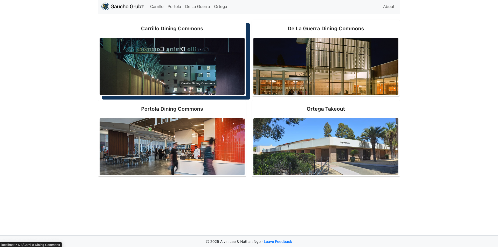
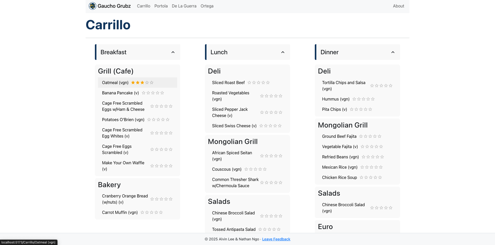
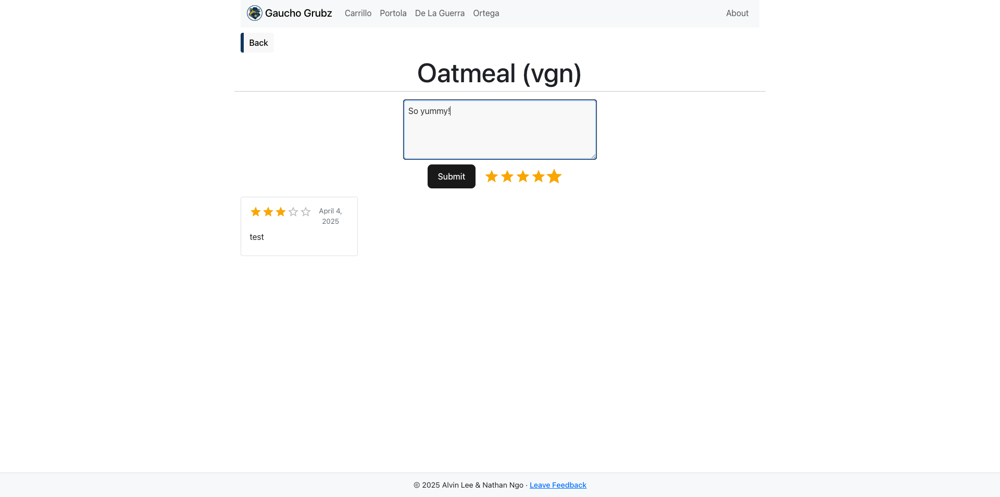
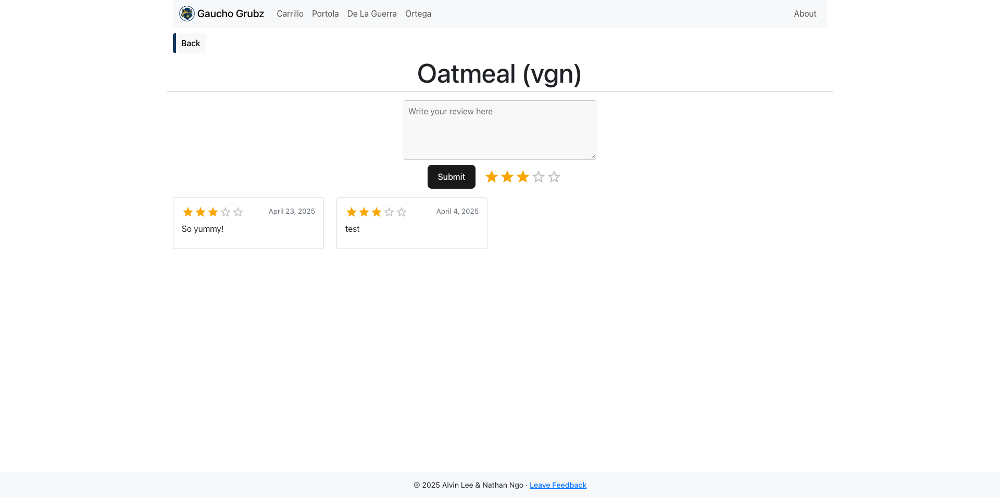

  

<h1 align="center">GauchoGrub</h1>

GauchoGrubz is a full-stack web application that allows UCSB students to view real-time dining hall menus and submit reviews for specific menu items. Built by Nathan Ngo and Alvin Lee as a collaborative project at UCSB to enhance student dining experiences by combining live data with crowd-sourced feedback.

## Features

- **Daily Menus** - View current menus by dining hall pulled from UCSB Dining API (Carrillo, Portola, Ortega, etc.)
- **Give Feedback** - Submit reviews and ratings for specific dishes
- **Read Feedback** - View average ratings and user feedback per food item
- **Smart UX** – Fast loading indicators, mobile-first layout, and one-click interactions
- **Profanity Filter** – Automatically blocks offensive content client-side
- **Average Ratings** – See what dishes students actually enjoy
- **Menu Caching** – Daily UCSB Dining data is cached in PostgreSQL for fast access

## Technologies Used

**Frontend**:
- React, React Router, Axios, React Bootstrap, Material UI
- Vite for fast builds and local development

**Backend**:
- Flask (Python), psycopg2, Requests
- Scheduled data fetch via `update_database.py`

**Database**:
- Supabase (PostgreSQL)
- Profanity-checked review system with one-review-per-user enforcement via `localStorage`

**API**:
- UCSB Dining API

**Deployment**:
- Frontend: Vercel  
- Backend: Render  
- Automation: GitHub Actions (runs nightly data pulls)

**Package Managers**:
- pip (Python)
- npm (Node.js)

**DevOps**:
- GitHub Actions
- .env files

## Database Schema

The PostgreSQL database uses three main tables:

### `menu_items`
Stores metadata for each unique menu item across dining halls and meals.

| Column      | Type    | Description                             |
|-------------|---------|-----------------------------------------|
| `id`        | int4    | Primary key                             |
| `name`      | text    | Name of the menu item                   |
| `dining_hall` | text  | Name of the dining hall (e.g. Carrillo) |
| `meal`      | text    | Meal type (Breakfast, Lunch, etc.)      |
| `station`   | text    | The food station serving the item       |
| `avg_rating`| float4  | Cached average rating for quick reads   |

---

### `reviews`
Stores all user-submitted reviews tied to a specific menu item.

| Column         | Type     | Description                                      |
|----------------|----------|--------------------------------------------------|
| `id`           | int4     | Primary key                                      |
| `menu_item_id` | int4     | Foreign key referencing `menu_items(id)`         |
| `rating`       | float4   | User rating (supports half-stars e.g., 4.5)      |
| `comment`      | text     | User review text (max 300 characters)            |
| `created_at`   | timestamp| Timestamp of when the review was created         |

---

### `daily_menu`
Stores pre-fetched UCSB Dining API data to reduce request latency.

| Column         | Type       | Description                                 |
|----------------|------------|---------------------------------------------|
| `date`         | date       | Primary key (one row per day)               |
| `data`         | text       | Full JSON blob of menu data for the day     |
| `last_updated` | timestamptz| Timestamp of last successful refresh        |

## API Routes

| Method | Route | Description |
|--------|-------|-------------|
| GET | `/` | Returns current menu data for all dining halls |
| POST | `/<dining_hall>/<item_name>` | Submits a review for a menu item |
| GET | `/<dining_hall>/<item_name>` | Returns all reviews + avg rating for an item |

## Deployment & Automation

- `update_database.py` pulls new dining hall data from UCSB API every 24 hours and inserts it into the SQLite database.
- Flask API runs locally or can be deployed to any cloud provider.
- React frontend runs locally or can be built for production.

## Screenshots

### Home Page – Dining Hall Selection

### Menu View – Food by Meal and Station

### Review Submission – Leave Feedback on Items

### Review Display – See What Others Said

## Contributors

- [Alvin Lee](https://github.com/nitron532)
- [Nathan Ngo](https://github.com/ngostream)
